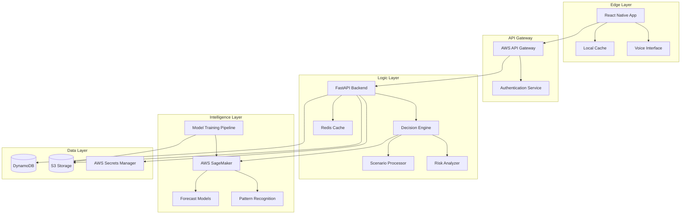
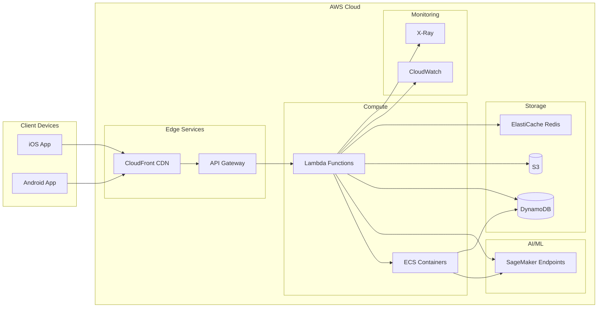

# Design Document: Sayam Platform

## Overview

The Sayam Platform is a three-tier AI-powered decision visibility system designed for Indian SMEs and retailers. The architecture consists of:

1. **Edge Layer**: React Native mobile application providing the user interface
2. **Logic Layer**: Python-based Decision Engine with FastAPI for business logic and scenario processing
3. **Intelligence Layer**: AWS SageMaker ML models for forecasting and pattern recognition

The platform enables business owners to simulate tactical decisions (hiring, inventory, store launches) and visualize their future impact through cash flow projections, risk signals, and comparative scenario analysis. The system is designed to handle the approximate, incomplete data typical of small Indian retail operations while providing actionable insights.

**Key Design Principles:**
- Mobile-first experience optimized for on-the-go decision making
- Offline-capable with intelligent caching for areas with poor connectivity
- Persistent business context to eliminate repetitive data entry
- Scalable serverless architecture to support 100,000+ users cost-effectively
- Bharat-first features including multilingual voice support and messy data handling

## Architecture

### System Architecture Diagram



### Deployment Architecture



## Components and Interfaces

### 1. Edge Layer Components

#### Mobile Application (React Native)

**Responsibilities:**
- Render user interface with calm, intuitive design
- Handle user input including touch gestures and voice commands
- Manage local caching for offline capability
- Display visualizations using D3.js
- Synchronize data with backend when connectivity available

**Key Modules:**
- `ScenarioBuilder`: UI for creating and configuring decision scenarios
- `VisualizationEngine`: Renders cash flow projections and impact graphs
- `OfflineManager`: Manages local cache and sync queue
- `VoiceHandler`: Processes voice input and output in multiple languages
- `NotificationManager`: Handles push notifications for risk signals

**Interface:**
```typescript
interface MobileApp {
  // Scenario Management
  createScenario(params: ScenarioParams): Promise<Scenario>
  compareScenarios(scenarioIds: string[]): Promise<Comparison>
  
  // Data Sync
  syncBusinessData(): Promise<SyncResult>
  getOfflineCapability(): OfflineStatus
  
  // Visualization
  renderCashFlowGraph(projection: CashFlowProjection): void
  renderRiskSignals(signals: RiskSignal[]): void
  
  // Voice Interface
  processVoiceQuery(audio: AudioBuffer, language: string): Promise<QueryResult>
  speakResponse(text: string, language: string): Promise<void>
}

interface ScenarioParams {
  type: 'hiring' | 'inventory' | 'store_launch' | 'custom'
  cost: number
  timing: Date
  duration?: number
  additionalParams: Record<string, any>
}

interface Scenario {
  id: string
  userId: string
  type: string
  params: ScenarioParams
  cashFlowProjection: CashFlowProjection
  riskSignals: RiskSignal[]
  createdAt: Date
  status: 'draft' | 'simulated' | 'executed'
}

interface CashFlowProjection {
  scenarioId: string
  timeline: TimePoint[]
  summary: {
    netChange: number
    lowestPoint: number
    lowestPointDate: Date
    breakEvenDate?: Date
  }
}

interface TimePoint {
  date: Date
  cashIn: number
  cashOut: number
  netCash: number
  confidence: number
}

interface RiskSignal {
  id: string
  scenarioId: string
  severity: 'low' | 'medium' | 'high' | 'critical'
  type: 'cashflow' | 'operational' | 'market'
  description: string
  projectedDate: Date
  mitigationSuggestions: string[]
  createdAt: Date
}
```

#### Local Cache Manager

**Responsibilities:**
- Store business context locally for offline access
- Cache recent scenarios and projections
- Queue user actions when offline
- Manage cache size and eviction policies

**Interface:**
```typescript
interface CacheManager {
  // Cache Operations
  cacheBusinessContext(context: BusinessContext): Promise<void>
  getCachedContext(): Promise<BusinessContext | null>
  cacheScenarios(scenarios: Scenario[]): Promise<void>
  getCachedScenarios(): Promise<Scenario[]>
  
  // Offline Queue
  queueAction(action: OfflineAction): Promise<void>
  getQueuedActions(): Promise<OfflineAction[]>
  clearQueue(): Promise<void>
  
  // Cache Management
  getCacheSize(): Promise<number>
  evictOldEntries(maxAge: number): Promise<void>
}

interface BusinessContext {
  userId: string
  businessProfile: BusinessProfile
  historicalData: HistoricalData
  executedDecisions: ExecutedDecision[]
  lastSyncedAt: Date
}

interface BusinessProfile {
  businessId: string
  name: string
  type: 'retail' | 'service' | 'manufacturing' | 'other'
  location: Location
  monthlyRevenue: number
  employeeCount: number
  inventoryValue?: number
}

interface Location {
  state: string
  city: string
  pincode: string
  region: string
}
```

### 2. Logic Layer Components

#### FastAPI Backend

**Responsibilities:**
- Handle HTTP requests from mobile clients
- Authenticate and authorize users
- Route requests to appropriate services
- Implement rate limiting and request validation
- Aggregate responses from multiple services

**Interface:**
```python
from fastapi import FastAPI, Depends, HTTPException
from typing import List, Optional
from datetime import datetime

class SayamAPI:
    """Main API application"""
    
    # Scenario Endpoints
    async def create_scenario(
        self,
        user_id: str,
        params: ScenarioParams,
        auth: AuthToken = Depends(verify_token)
    ) -> Scenario:
        """Create and simulate a new decision scenario"""
        pass
    
    async def get_scenarios(
        self,
        user_id: str,
        limit: int = 10,
        auth: AuthToken = Depends(verify_token)
    ) -> List[Scenario]:
        """Retrieve user's scenarios"""
        pass
    
    async def compare_scenarios(
        self,
        user_id: str,
        scenario_ids: List[str],
        auth: AuthToken = Depends(verify_token)
    ) -> ScenarioComparison:
        """Compare multiple scenarios side-by-side"""
        pass
    
    # Business Data Endpoints
    async def sync_business_data(
        self,
        user_id: str,
        data: BusinessDataUpdate,
        auth: AuthToken = Depends(verify_token)
    ) -> SyncResult:
        """Sync business statistics and state"""
        pass
    
    async def get_business_context(
        self,
        user_id: str,
        auth: AuthToken = Depends(verify_token)
    ) -> BusinessContext:
        """Retrieve persistent business context"""
        pass
    
    # Decision Execution Endpoints
    async def execute_decision(
        self,
        user_id: str,
        scenario_id: str,
        auth: AuthToken = Depends(verify_token)
    ) -> ExecutedDecision:
        """Mark a scenario as executed"""
        pass
    
    async def record_outcome(
        self,
        user_id: str,
        decision_id: str,
        outcome: DecisionOutcome,
        auth: AuthToken = Depends(verify_token)
    ) -> None:
        """Record actual outcome of executed decision"""
        pass
```

#### Decision Engine

**Responsibilities:**
- Process scenario parameters into simulation inputs
- Coordinate with ML models for forecasting
- Generate cash flow projections
- Identify and generate risk signals
- Calculate comparative metrics between scenarios

**Interface:**
```python
from dataclasses import dataclass
from typing import List, Dict, Optional
from datetime import datetime, timedelta

class DecisionEngine:
    """Core decision simulation and analysis engine"""
    
    def __init__(
        self,
        forecast_service: ForecastService,
        risk_analyzer: RiskAnalyzer,
        context_store: ContextStore
    ):
        self.forecast_service = forecast_service
        self.risk_analyzer = risk_analyzer
        self.context_store = context_store
    
    async def simulate_scenario(
        self,
        user_id: str,
        params: ScenarioParams
    ) -> Scenario:
        """
        Simulate a decision scenario and generate projections
        
        Process:
        1. Load business context
        2. Generate baseline forecast
        3. Apply scenario parameters
        4. Generate modified forecast
        5. Calculate cash flow projection
        6. Identify risk signals
        7. Return complete scenario
        """
        pass
    
    async def compare_scenarios(
        self,
        scenarios: List[Scenario]
    ) -> ScenarioComparison:
        """
        Compare multiple scenarios and highlight differences
        
        Returns comparative metrics including:
        - Net cash impact difference
        - Risk level comparison
        - Break-even timeline comparison
        - Operational impact differences
        """
        pass
    
    def calculate_cash_flow(
        self,
        baseline: Forecast,
        scenario_impact: ScenarioImpact,
        duration_days: int = 90
    ) -> CashFlowProjection:
        """Calculate day-by-day cash flow projection"""
        pass

@dataclass
class ScenarioImpact:
    """Impact of a decision on business operations"""
    initial_cost: float
    recurring_cost: float
    revenue_multiplier: float
    operational_changes: Dict[str, float]
    timing_offset_days: int
```

#### Risk Analyzer

**Responsibilities:**
- Analyze cash flow projections for potential issues
- Identify cash flow crunches, operational bottlenecks
- Generate risk signals with severity levels
- Provide mitigation suggestions
- Prioritize risks by timing and severity

**Interface:**
```python
from typing import List, Tuple
from enum import Enum

class RiskSeverity(Enum):
    LOW = "low"
    MEDIUM = "medium"
    HIGH = "high"
    CRITICAL = "critical"

class RiskType(Enum):
    CASHFLOW = "cashflow"
    OPERATIONAL = "operational"
    MARKET = "market"

class RiskAnalyzer:
    """Analyzes scenarios for potential risks"""
    
    def __init__(
        self,
        cashflow_threshold: float = 0.1,  # 10% of monthly revenue
        critical_days: int = 30
    ):
        self.cashflow_threshold = cashflow_threshold
        self.critical_days = critical_days
    
    def analyze_scenario(
        self,
        scenario: Scenario,
        business_context: BusinessContext
    ) -> List[RiskSignal]:
        """
        Analyze scenario for risks
        
        Checks:
        1. Cash flow drops below safety threshold
        2. Negative cash flow periods
        3. Operational capacity constraints
        4. Market timing risks
        """
        pass
    
    def detect_cashflow_risks(
        self,
        projection: CashFlowProjection,
        safety_threshold: float
    ) -> List[RiskSignal]:
        """Detect cash flow related risks"""
        pass
    
    def detect_operational_risks(
        self,
        scenario: Scenario,
        business_context: BusinessContext
    ) -> List[RiskSignal]:
        """Detect operational bottlenecks and constraints"""
        pass
    
    def generate_mitigation_suggestions(
        self,
        risk: RiskSignal,
        business_context: BusinessContext
    ) -> List[str]:
        """Generate actionable mitigation suggestions"""
        pass
    
    def prioritize_risks(
        self,
        risks: List[RiskSignal]
    ) -> List[RiskSignal]:
        """Sort risks by severity and timing"""
        pass
```

### 3. Intelligence Layer Components

#### Forecast Service

**Responsibilities:**
- Interface with AWS SageMaker models
- Generate demand forecasts based on historical data
- Incorporate hyper-local market trends
- Provide confidence intervals for predictions
- Handle model versioning and A/B testing

**Interface:**
```python
from typing import List, Optional
import numpy as np

class ForecastService:
    """Interface to ML forecasting models"""
    
    def __init__(
        self,
        sagemaker_client,
        model_endpoint: str,
        regional_data_service: RegionalDataService
    ):
        self.sagemaker_client = sagemaker_client
        self.model_endpoint = model_endpoint
        self.regional_data = regional_data_service
    
    async def generate_forecast(
        self,
        business_context: BusinessContext,
        horizon_days: int = 90
    ) -> Forecast:
        """
        Generate demand and revenue forecast
        
        Process:
        1. Prepare features from business context
        2. Load regional market trends
        3. Invoke SageMaker endpoint
        4. Post-process predictions
        5. Calculate confidence intervals
        """
        pass
    
    async def get_hyper_local_trends(
        self,
        location: Location,
        business_type: str
    ) -> HyperLocalTrends:
        """Retrieve regional market trends"""
        pass
    
    def prepare_features(
        self,
        business_context: BusinessContext,
        regional_trends: HyperLocalTrends
    ) -> np.ndarray:
        """Prepare feature vector for ML model"""
        pass

@dataclass
class Forecast:
    """Forecast output from ML models"""
    business_id: str
    start_date: datetime
    end_date: datetime
    daily_revenue: List[float]
    daily_revenue_lower: List[float]  # Lower confidence bound
    daily_revenue_upper: List[float]  # Upper confidence bound
    confidence: float
    model_version: str
    generated_at: datetime

@dataclass
class HyperLocalTrends:
    """Regional market trends"""
    location: Location
    seasonal_factors: Dict[int, float]  # month -> multiplier
    growth_rate: float
    market_events: List[MarketEvent]
    competitor_density: float
```

#### Pattern Recognition Service

**Responsibilities:**
- Identify patterns in historical business data
- Detect seasonal trends and cycles
- Learn from executed decisions and outcomes
- Improve forecast accuracy over time
- Flag anomalies in business data

**Interface:**
```python
class PatternRecognitionService:
    """Identifies patterns in business data"""
    
    async def analyze_historical_data(
        self,
        business_context: BusinessContext
    ) -> PatternAnalysis:
        """
        Analyze historical data for patterns
        
        Identifies:
        - Seasonal patterns
        - Growth trends
        - Cyclical behaviors
        - Anomalies
        """
        pass
    
    async def learn_from_outcomes(
        self,
        executed_decision: ExecutedDecision,
        actual_outcome: DecisionOutcome
    ) -> None:
        """
        Learn from actual decision outcomes
        
        Updates:
        - Prediction accuracy metrics
        - Model confidence adjustments
        - Business-specific patterns
        """
        pass
    
    def detect_anomalies(
        self,
        recent_data: List[DataPoint],
        historical_patterns: PatternAnalysis
    ) -> List[Anomaly]:
        """Detect unusual patterns in recent data"""
        pass

@dataclass
class PatternAnalysis:
    """Results of pattern recognition"""
    business_id: str
    seasonal_patterns: Dict[str, float]
    trend_direction: str  # 'growing', 'stable', 'declining'
    trend_strength: float
    cycle_length_days: Optional[int]
    anomalies: List[Anomaly]
    confidence: float
```

### 4. Data Layer Components

#### Context Store (DynamoDB)

**Responsibilities:**
- Store and retrieve business context
- Store scenarios and projections
- Store executed decisions and outcomes
- Provide fast access to user data
- Handle concurrent access safely

**Schema Design:**

```python
# Primary Table: BusinessContexts
{
    "PK": "USER#<user_id>",
    "SK": "CONTEXT",
    "userId": str,
    "businessProfile": dict,
    "historicalData": dict,
    "lastSyncedAt": str (ISO datetime),
    "createdAt": str,
    "updatedAt": str,
    "GSI1PK": "BUSINESS#<business_id>",
    "GSI1SK": "USER#<user_id>"
}

# Scenarios Table
{
    "PK": "USER#<user_id>",
    "SK": "SCENARIO#<scenario_id>",
    "scenarioId": str,
    "userId": str,
    "type": str,
    "params": dict,
    "cashFlowProjection": dict,
    "riskSignals": list,
    "status": str,
    "createdAt": str,
    "GSI1PK": "SCENARIO#<scenario_id>",
    "GSI1SK": "CREATED#<timestamp>"
}

# Executed Decisions Table
{
    "PK": "USER#<user_id>",
    "SK": "DECISION#<decision_id>",
    "decisionId": str,
    "scenarioId": str,
    "userId": str,
    "executedAt": str,
    "projectedOutcome": dict,
    "actualOutcome": dict,
    "accuracyMetrics": dict,
    "GSI1PK": "DECISION#<decision_id>",
    "GSI1SK": "EXECUTED#<timestamp>"
}
```

**Interface:**
```python
class ContextStore:
    """DynamoDB interface for business context"""
    
    async def save_business_context(
        self,
        context: BusinessContext
    ) -> None:
        """Save or update business context"""
        pass
    
    async def get_business_context(
        self,
        user_id: str
    ) -> Optional[BusinessContext]:
        """Retrieve business context"""
        pass
    
    async def save_scenario(
        self,
        scenario: Scenario
    ) -> None:
        """Save scenario"""
        pass
    
    async def get_scenarios(
        self,
        user_id: str,
        limit: int = 10
    ) -> List[Scenario]:
        """Retrieve user scenarios"""
        pass
    
    async def save_executed_decision(
        self,
        decision: ExecutedDecision
    ) -> None:
        """Save executed decision"""
        pass
    
    async def update_decision_outcome(
        self,
        decision_id: str,
        outcome: DecisionOutcome
    ) -> None:
        """Update decision with actual outcome"""
        pass
```

#### Model Storage (S3)

**Responsibilities:**
- Store trained ML models
- Store historical training data
- Store model artifacts and metadata
- Implement lifecycle policies for cost optimization
- Provide versioned model access

**Bucket Structure:**
```
sayam-models/
├── forecasting/
│   ├── v1.0/
│   │   ├── model.tar.gz
│   │   ├── metadata.json
│   │   └── training_metrics.json
│   └── v1.1/
├── pattern-recognition/
│   └── v1.0/
├── training-data/
│   ├── 2024-01/
│   └── 2024-02/
└── regional-benchmarks/
    ├── maharashtra/
    ├── karnataka/
    └── tamil-nadu/
```

## Data Models

### Core Domain Models

```python
from dataclasses import dataclass
from typing import List, Dict, Optional
from datetime import datetime
from enum import Enum

@dataclass
class BusinessContext:
    """Complete business state and history"""
    user_id: str
    business_profile: BusinessProfile
    historical_data: HistoricalData
    executed_decisions: List[ExecutedDecision]
    last_synced_at: datetime
    created_at: datetime
    updated_at: datetime

@dataclass
class BusinessProfile:
    """Business identity and characteristics"""
    business_id: str
    name: str
    type: str  # 'retail', 'service', 'manufacturing', 'other'
    location: Location
    monthly_revenue: float
    employee_count: int
    inventory_value: Optional[float]
    established_date: datetime
    owner_name: str
    contact_info: ContactInfo

@dataclass
class Location:
    """Geographic location"""
    state: str
    city: str
    pincode: str
    region: str  # For hyper-local trends
    latitude: Optional[float]
    longitude: Optional[float]

@dataclass
class HistoricalData:
    """Historical business metrics"""
    business_id: str
    daily_revenue: List[DataPoint]
    daily_expenses: List[DataPoint]
    inventory_levels: List[DataPoint]
    employee_changes: List[EmployeeChange]
    data_quality: str  # 'complete', 'partial', 'sparse'
    last_updated: datetime

@dataclass
class DataPoint:
    """Single time-series data point"""
    date: datetime
    value: float
    confidence: float  # 0.0 to 1.0
    source: str  # 'manual', 'integrated', 'estimated'

@dataclass
class Scenario:
    """Decision scenario with projections"""
    id: str
    user_id: str
    type: str  # 'hiring', 'inventory', 'store_launch', 'custom'
    params: ScenarioParams
    cash_flow_projection: CashFlowProjection
    risk_signals: List[RiskSignal]
    created_at: datetime
    status: str  # 'draft', 'simulated', 'executed'
    metadata: Dict[str, any]

@dataclass
class ScenarioParams:
    """Parameters defining a decision scenario"""
    type: str
    cost: float
    timing: datetime
    duration_days: Optional[int]
    additional_params: Dict[str, any]
    # Type-specific params:
    # hiring: {'role': str, 'salary': float, 'ramp_up_days': int}
    # inventory: {'items': List, 'storage_cost': float, 'turnover_days': int}
    # store_launch: {'location': Location, 'size_sqft': int, 'rent': float}

@dataclass
class CashFlowProjection:
    """Projected cash flow over time"""
    scenario_id: str
    timeline: List[TimePoint]
    summary: CashFlowSummary
    generated_at: datetime
    model_version: str

@dataclass
class TimePoint:
    """Single point in cash flow timeline"""
    date: datetime
    cash_in: float
    cash_out: float
    net_cash: float
    cumulative_net: float
    confidence: float

@dataclass
class CashFlowSummary:
    """Summary statistics for cash flow"""
    net_change: float
    lowest_point: float
    lowest_point_date: datetime
    highest_point: float
    highest_point_date: datetime
    break_even_date: Optional[datetime]
    total_cash_in: float
    total_cash_out: float

@dataclass
class RiskSignal:
    """Alert for potential problem"""
    id: str
    scenario_id: str
    severity: str  # 'low', 'medium', 'high', 'critical'
    type: str  # 'cashflow', 'operational', 'market'
    description: str
    projected_date: datetime
    impact_amount: Optional[float]
    mitigation_suggestions: List[str]
    created_at: datetime
    acknowledged: bool

@dataclass
class ExecutedDecision:
    """Record of executed scenario"""
    decision_id: str
    scenario_id: str
    user_id: str
    executed_at: datetime
    projected_outcome: ProjectedOutcome
    actual_outcome: Optional[DecisionOutcome]
    accuracy_metrics: Optional[AccuracyMetrics]

@dataclass
class ProjectedOutcome:
    """What was predicted"""
    net_cash_impact_90d: float
    break_even_days: Optional[int]
    risk_level: str
    key_metrics: Dict[str, float]

@dataclass
class DecisionOutcome:
    """Actual results of decision"""
    decision_id: str
    actual_cash_impact: float
    actual_break_even_days: Optional[int]
    unexpected_issues: List[str]
    recorded_at: datetime
    notes: Optional[str]

@dataclass
class AccuracyMetrics:
    """Comparison of projected vs actual"""
    cash_impact_error_pct: float
    break_even_error_days: Optional[int]
    risk_prediction_correct: bool
    overall_accuracy_score: float  # 0.0 to 1.0
```

### ML Model Data Structures

```python
@dataclass
class Forecast:
    """ML model forecast output"""
    business_id: str
    start_date: datetime
    end_date: datetime
    daily_revenue: List[float]
    daily_revenue_lower: List[float]
    daily_revenue_upper: List[float]
    confidence: float
    model_version: str
    features_used: List[str]
    generated_at: datetime

@dataclass
class HyperLocalTrends:
    """Regional market intelligence"""
    location: Location
    seasonal_factors: Dict[int, float]  # month -> multiplier
    growth_rate: float
    market_events: List[MarketEvent]
    competitor_density: float
    consumer_behavior: Dict[str, float]
    data_freshness_days: int

@dataclass
class MarketEvent:
    """Significant market event"""
    event_type: str  # 'festival', 'holiday', 'local_event'
    name: str
    date: datetime
    impact_multiplier: float
    affected_categories: List[str]

@dataclass
class PatternAnalysis:
    """Pattern recognition results"""
    business_id: str
    seasonal_patterns: Dict[str, float]
    trend_direction: str
    trend_strength: float
    cycle_length_days: Optional[int]
    anomalies: List[Anomaly]
    confidence: float
    analyzed_at: datetime

@dataclass
class Anomaly:
    """Detected anomaly in data"""
    date: datetime
    metric: str
    expected_value: float
    actual_value: float
    deviation_pct: float
    possible_causes: List[str]
```

### API Request/Response Models

```python
@dataclass
class CreateScenarioRequest:
    """Request to create scenario"""
    type: str
    cost: float
    timing: str  # ISO datetime
    duration_days: Optional[int]
    additional_params: Dict[str, any]

@dataclass
class CreateScenarioResponse:
    """Response with created scenario"""
    scenario: Scenario
    processing_time_ms: int

@dataclass
class CompareScenarios Request:
    """Request to compare scenarios"""
    scenario_ids: List[str]

@dataclass
class ComparisonResult:
    """Scenario comparison output"""
    scenarios: List[Scenario]
    comparative_metrics: ComparativeMetrics
    recommendation: Optional[str]

@dataclass
class ComparativeMetrics:
    """Metrics comparing scenarios"""
    net_cash_differences: Dict[str, float]
    risk_level_comparison: Dict[str, str]
    break_even_comparison: Dict[str, Optional[int]]
    best_case_scenario_id: str
    worst_case_scenario_id: str

@dataclass
class SyncBusinessDataRequest:
    """Request to sync business data"""
    revenue_data: List[DataPoint]
    expense_data: List[DataPoint]
    inventory_data: Optional[List[DataPoint]]
    employee_changes: Optional[List[EmployeeChange]]
    sync_source: str  # 'manual', 'csv_import', 'api_integration'

@dataclass
class SyncResult:
    """Result of data sync"""
    success: bool
    records_processed: int
    records_accepted: int
    records_rejected: int
    validation_errors: List[ValidationError]
    last_synced_at: datetime
```


## Correctness Properties

A property is a characteristic or behavior that should hold true across all valid executions of a system—essentially, a formal statement about what the system should do. Properties serve as the bridge between human-readable specifications and machine-verifiable correctness guarantees.

### Property Reflection

After analyzing all acceptance criteria, I identified the following redundancies and consolidations:

**Redundancy Analysis:**
- Properties 1.2, 1.3, and 15.5 all relate to data validation - consolidated into a single comprehensive validation property
- Properties 1.5 and 5.1 both test persistence round-trip - consolidated into one property
- Properties 2.1 and 2.3 both test scenario creation - combined into comprehensive scenario generation property
- Properties 4.2 and 4.5 both test risk signal structure - combined into single structure validation property
- Properties 11.3 and 11.4 both test outcome comparison - consolidated into one property
- Properties 13.1 and 13.2 both test metrics tracking - combined into comprehensive logging property

### Core Properties

#### Property 1: Data Validation Completeness
*For any* business data input (manual, CSV, or API), the validation system should identify all missing critical fields and provide specific guidance for each missing field.

**Validates: Requirements 1.2, 1.3, 15.4, 15.5**

#### Property 2: Business Context Persistence Round-Trip
*For any* business context saved to storage, retrieving it should produce an equivalent context with all data preserved.

**Validates: Requirements 1.5, 5.1, 5.3**

#### Property 3: Scenario Generation Completeness
*For any* valid scenario parameters, the Decision Engine should generate a complete scenario including 90-day cash flow projection and risk analysis.

**Validates: Requirements 2.1, 2.3**

#### Property 4: Scenario Comparison Structure
*For any* set of 2 or more scenarios, the comparison output should contain cash flow differences, risk level comparisons, and break-even timeline comparisons for all scenarios.

**Validates: Requirements 2.4, 2.5**

#### Property 5: Forecast Confidence Intervals
*For any* forecast generated by the Intelligence Layer, the output should include upper and lower confidence bounds for all predicted values.

**Validates: Requirements 3.3**

#### Property 6: Sparse Data Handling
*For any* business with sparse historical data (less than 30 days), the forecast should incorporate regional market benchmarks and not fail.

**Validates: Requirements 3.6**

#### Property 7: Risk Signal Generation
*For any* scenario where projected cash flow drops below the safety threshold, at least one risk signal should be generated with severity level appropriate to the magnitude of the drop.

**Validates: Requirements 4.1**

#### Property 8: Risk Signal Structure Completeness
*For any* risk signal generated, it should contain timing, severity, root cause description, and at least one mitigation suggestion.

**Validates: Requirements 4.2, 4.5**

#### Property 9: Risk Prioritization Ordering
*For any* set of risk signals, when prioritized, signals with higher severity should appear before lower severity, and within the same severity, signals with earlier projected dates should appear first.

**Validates: Requirements 4.4**

#### Property 10: High Priority Risk Classification
*For any* risk signal with projected date within 30 days, the priority level should be marked as "high" or "critical".

**Validates: Requirements 4.6**

#### Property 11: Offline Action Queueing
*For any* user action performed while offline, the action should appear in the sync queue and be synchronized when connectivity is restored.

**Validates: Requirements 8.1, 8.4**

#### Property 12: Visualization Risk Highlighting
*For any* cash flow projection containing risk signals, the visualization should include visual highlights at the dates corresponding to each risk.

**Validates: Requirements 9.5**

#### Property 13: Decision Execution Recording
*For any* decision marked as executed, the system should record the execution timestamp, original scenario parameters, and projected outcomes.

**Validates: Requirements 11.1**

#### Property 14: Outcome Comparison Calculation
*For any* executed decision with recorded actual outcome, the system should calculate accuracy metrics including cash impact error percentage and break-even error days.

**Validates: Requirements 11.3, 11.4**

#### Property 15: Accuracy-Based Flagging
*For any* executed decision where prediction accuracy score falls below 0.7, the system should flag it for model improvement review.

**Validates: Requirements 11.5**

#### Property 16: Role-Based Access Control
*For any* user with an assigned role, access to features and data should be restricted according to the permissions defined for that role.

**Validates: Requirements 12.4**

#### Property 17: Data Deletion Completeness
*For any* user data deletion request, all associated records (business context, scenarios, decisions, outcomes) should be removed from all storage systems.

**Validates: Requirements 12.6**

#### Property 18: Comprehensive Logging
*For any* Decision Engine operation or ML model inference, processing time and relevant metrics should be logged with timestamp and operation identifier.

**Validates: Requirements 13.1, 13.2**

#### Property 19: Voice Input Processing
*For any* valid voice input in a supported language, the system should produce a transcription and extract the decision query intent.

**Validates: Requirements 7.2**

#### Property 20: Voice Output Language Consistency
*For any* response generated when voice mode is enabled, the output should be in the same language as the user's selected preference.

**Validates: Requirements 7.3**

#### Property 21: CSV Import Validation
*For any* CSV file with valid structure, the import should either succeed completely or fail with specific error messages indicating which rows or fields caused the failure.

**Validates: Requirements 15.3**

#### Property 22: Hyper-Local Trend Incorporation
*For any* forecast generated for a business, the forecast features should include regional trends specific to the business's geographic location.

**Validates: Requirements 3.2**

#### Property 23: Pattern Recognition on Historical Data
*For any* business with at least 90 days of historical data, the pattern analysis should identify and quantify seasonal patterns if they exist.

**Validates: Requirements 3.1**

### Example-Based Tests

These are specific scenarios that should be verified:

#### Example 1: Supported Scenario Types
The system should successfully process scenarios of type "hiring", "inventory", and "store_launch".

**Validates: Requirements 2.2**

#### Example 2: Forecast Accuracy Threshold Alert
When forecast accuracy drops to 69%, an administrator notification should be triggered.

**Validates: Requirements 3.5**

#### Example 3: Multilingual Voice Support
The system should support voice input and output in Hindi, Tamil, Telugu, Kannada, Bengali, and Marathi.

**Validates: Requirements 7.1**

#### Example 4: Low Confidence Voice Clarification
When voice recognition confidence is 75%, the system should request user clarification.

**Validates: Requirements 7.4**

#### Example 5: Language Switching Without Restart
Changing the app language from Hindi to English should not require app restart and should update all UI text immediately.

**Validates: Requirements 7.5**

#### Example 6: Offline Scenario Cache Size
The Edge Layer should cache exactly the 10 most recent scenarios for offline access.

**Validates: Requirements 8.2**

#### Example 7: Offline Feature Indicators
When operating offline, features requiring connectivity (like creating new scenarios) should display clear "offline" indicators.

**Validates: Requirements 8.3**

#### Example 8: Cash Flow Color Coding
Positive cash flow periods should be displayed in green, negative in red, and neutral in gray.

**Validates: Requirements 9.2**

#### Example 9: Visualization Zoom and Pan
The timeline visualization should support pinch-to-zoom and drag-to-pan gestures.

**Validates: Requirements 9.3**

#### Example 10: Multi-Scenario Overlay
When comparing 3 scenarios, all 3 cash flow projections should be overlaid on a single graph with distinct colors.

**Validates: Requirements 9.4**

#### Example 11: AES-256 Encryption
Business context data stored in DynamoDB should be encrypted using AES-256 algorithm.

**Validates: Requirements 5.5, 12.1**

#### Example 12: Multi-Factor Authentication
User login should require both password and a second factor (OTP or authenticator app).

**Validates: Requirements 12.3**

#### Example 13: Latency Alert Threshold
When system latency exceeds 5 seconds, an automated alert should be sent to operations team.

**Validates: Requirements 13.3**

#### Example 14: Model Retraining Trigger
When overall model accuracy drops to 68%, automated retraining pipeline should be initiated.

**Validates: Requirements 13.5**

#### Example 15: New User Tutorial
First-time app launch should display an interactive tutorial before showing the main interface.

**Validates: Requirements 14.1**

#### Example 16: Onboarding Skip and Replay
Users should be able to skip the tutorial and access it later from settings menu.

**Validates: Requirements 14.5**

#### Example 17: OAuth 2.0 Integration
Third-party accounting software integrations should use OAuth 2.0 authorization flow.

**Validates: Requirements 15.6**

#### Example 18: Mobile Graph Rendering
Scenario visualization should render without errors on mobile screens (tested on 375px width).

**Validates: Requirements 6.2**

#### Example 19: One-Tap Simulation
Home screen should have a prominent "Simulate Decision" button that opens scenario builder in one tap.

**Validates: Requirements 6.3**

#### Example 20: Poor Connectivity Feedback
When network latency exceeds 3 seconds, a "Slow connection" message should appear.

**Validates: Requirements 6.4**

## Error Handling

### Error Categories

The Sayam Platform implements comprehensive error handling across four categories:

#### 1. Data Validation Errors

**Scenarios:**
- Missing required fields in business data
- Invalid data types or formats
- Data outside acceptable ranges
- Inconsistent or contradictory data

**Handling Strategy:**
```python
class ValidationError(Exception):
    """Data validation failure"""
    def __init__(
        self,
        field: str,
        value: any,
        reason: str,
        guidance: str
    ):
        self.field = field
        self.value = value
        self.reason = reason
        self.guidance = guidance
        super().__init__(f"{field}: {reason}")

# Example usage
if not business_data.monthly_revenue or business_data.monthly_revenue <= 0:
    raise ValidationError(
        field="monthly_revenue",
        value=business_data.monthly_revenue,
        reason="Monthly revenue must be a positive number",
        guidance="Please enter your average monthly revenue in rupees. If you're unsure, provide an estimate."
    )
```

**User Experience:**
- Clear error messages in user's language
- Specific guidance on how to correct the error
- Highlight problematic fields in UI
- Allow partial data submission with warnings

#### 2. ML Model Errors

**Scenarios:**
- Model inference timeout
- Model endpoint unavailable
- Unexpected model output format
- Low confidence predictions

**Handling Strategy:**
```python
class ModelError(Exception):
    """ML model operation failure"""
    pass

async def generate_forecast_with_fallback(
    business_context: BusinessContext
) -> Forecast:
    """Generate forecast with fallback strategies"""
    try:
        # Try primary model
        forecast = await primary_model.predict(business_context)
        if forecast.confidence < 0.5:
            # Low confidence, try ensemble
            forecast = await ensemble_model.predict(business_context)
        return forecast
    except ModelTimeoutError:
        # Use cached regional benchmarks
        return generate_benchmark_forecast(business_context.location)
    except ModelUnavailableError:
        # Use simple trend extrapolation
        return generate_trend_forecast(business_context.historical_data)
```

**User Experience:**
- Graceful degradation to simpler models
- Clear indication of forecast confidence level
- Explanation when fallback methods are used
- Option to retry with updated data

#### 3. Network and Connectivity Errors

**Scenarios:**
- API request timeout
- Network unavailable
- Partial data transmission
- Sync conflicts

**Handling Strategy:**
```python
class NetworkError(Exception):
    """Network operation failure"""
    pass

class SyncConflictError(Exception):
    """Data sync conflict"""
    def __init__(self, local_version, server_version):
        self.local_version = local_version
        self.server_version = server_version

async def sync_with_retry(
    data: BusinessContext,
    max_retries: int = 3
) -> SyncResult:
    """Sync with exponential backoff retry"""
    for attempt in range(max_retries):
        try:
            return await api_client.sync(data)
        except NetworkTimeout:
            if attempt < max_retries - 1:
                await asyncio.sleep(2 ** attempt)  # Exponential backoff
            else:
                # Queue for later sync
                await offline_queue.add(data)
                return SyncResult(
                    success=False,
                    queued=True,
                    message="Queued for sync when connection improves"
                )
        except SyncConflictError as e:
            # Resolve conflict using last-write-wins with user confirmation
            return await resolve_conflict(e.local_version, e.server_version)
```

**User Experience:**
- Automatic retry with exponential backoff
- Queue actions for later sync when offline
- Clear sync status indicators
- Conflict resolution with user input when needed

#### 4. Business Logic Errors

**Scenarios:**
- Insufficient data for scenario simulation
- Invalid scenario parameters
- Risk calculation failures
- Comparison of incompatible scenarios

**Handling Strategy:**
```python
class BusinessLogicError(Exception):
    """Business logic constraint violation"""
    pass

class InsufficientDataError(BusinessLogicError):
    """Not enough data for operation"""
    def __init__(self, required_days: int, available_days: int):
        self.required_days = required_days
        self.available_days = available_days
        super().__init__(
            f"Need {required_days} days of data, only {available_days} available"
        )

def validate_scenario_params(params: ScenarioParams) -> None:
    """Validate scenario parameters"""
    if params.type == "hiring":
        if "salary" not in params.additional_params:
            raise BusinessLogicError(
                "Hiring scenario requires salary parameter"
            )
        if params.additional_params["salary"] > params.cost * 12:
            raise BusinessLogicError(
                "Annual salary cannot exceed 12x monthly cost"
            )
    
    if params.timing < datetime.now():
        raise BusinessLogicError(
            "Scenario timing must be in the future"
        )
```

**User Experience:**
- Prevent invalid operations before submission
- Suggest alternative approaches when data insufficient
- Provide examples of valid parameter ranges
- Guide users to collect necessary data

### Error Recovery Patterns

#### Pattern 1: Graceful Degradation

When optimal functionality unavailable, provide reduced but useful functionality:

```python
async def create_scenario(params: ScenarioParams) -> Scenario:
    """Create scenario with graceful degradation"""
    try:
        # Try full ML-powered simulation
        forecast = await ml_forecast_service.generate(params)
        risks = await risk_analyzer.analyze(forecast)
        return Scenario(
            params=params,
            forecast=forecast,
            risks=risks,
            quality="high"
        )
    except ModelUnavailableError:
        # Fall back to rule-based estimation
        forecast = rule_based_estimator.generate(params)
        risks = simple_risk_checker.analyze(forecast)
        return Scenario(
            params=params,
            forecast=forecast,
            risks=risks,
            quality="estimated",
            warning="Using simplified estimation due to service unavailability"
        )
```

#### Pattern 2: Retry with Backoff

For transient failures, retry with increasing delays:

```python
async def call_with_retry(
    func: Callable,
    max_attempts: int = 3,
    base_delay: float = 1.0
) -> any:
    """Execute function with exponential backoff retry"""
    last_error = None
    for attempt in range(max_attempts):
        try:
            return await func()
        except (NetworkTimeout, ServiceUnavailable) as e:
            last_error = e
            if attempt < max_attempts - 1:
                delay = base_delay * (2 ** attempt)
                await asyncio.sleep(delay)
    raise last_error
```

#### Pattern 3: Circuit Breaker

Prevent cascading failures by temporarily disabling failing services:

```python
class CircuitBreaker:
    """Circuit breaker for external services"""
    def __init__(
        self,
        failure_threshold: int = 5,
        timeout_seconds: int = 60
    ):
        self.failure_count = 0
        self.failure_threshold = failure_threshold
        self.timeout_seconds = timeout_seconds
        self.last_failure_time = None
        self.state = "closed"  # closed, open, half-open
    
    async def call(self, func: Callable) -> any:
        """Execute function through circuit breaker"""
        if self.state == "open":
            if (datetime.now() - self.last_failure_time).seconds > self.timeout_seconds:
                self.state = "half-open"
            else:
                raise ServiceUnavailableError("Circuit breaker open")
        
        try:
            result = await func()
            if self.state == "half-open":
                self.state = "closed"
                self.failure_count = 0
            return result
        except Exception as e:
            self.failure_count += 1
            self.last_failure_time = datetime.now()
            if self.failure_count >= self.failure_threshold:
                self.state = "open"
            raise e
```

## Testing Strategy

The Sayam Platform employs a comprehensive dual testing approach combining property-based testing for universal correctness guarantees with example-based unit testing for specific scenarios and edge cases.

### Testing Philosophy

**Complementary Approaches:**
- **Property-Based Tests**: Verify universal properties hold across all possible inputs through randomized testing
- **Unit Tests**: Verify specific examples, edge cases, and integration points
- **Together**: Provide comprehensive coverage where property tests catch general correctness issues and unit tests validate concrete behaviors

**Balance:**
- Avoid writing excessive unit tests for scenarios already covered by properties
- Focus unit tests on:
  - Specific examples that demonstrate correct behavior
  - Edge cases and boundary conditions
  - Error handling paths
  - Integration between components
- Use property tests for:
  - Universal invariants and rules
  - Data transformation correctness
  - API contract validation
  - Round-trip properties

### Property-Based Testing Configuration

**Framework Selection:**
- **Python Backend**: Use `hypothesis` library for property-based testing
- **TypeScript/React Native**: Use `fast-check` library for property-based testing

**Configuration Standards:**
```python
# Python example with hypothesis
from hypothesis import given, settings, strategies as st

@settings(max_examples=100)  # Minimum 100 iterations
@given(
    business_context=st.builds(BusinessContext),
    scenario_params=st.builds(ScenarioParams)
)
def test_scenario_generation_completeness(
    business_context: BusinessContext,
    scenario_params: ScenarioParams
):
    """
    Feature: sayam-platform, Property 3: Scenario Generation Completeness
    
    For any valid scenario parameters, the Decision Engine should generate
    a complete scenario including 90-day cash flow projection and risk analysis.
    """
    scenario = decision_engine.create_scenario(
        business_context,
        scenario_params
    )
    
    assert scenario is not None
    assert scenario.cash_flow_projection is not None
    assert len(scenario.cash_flow_projection.timeline) == 90
    assert scenario.risk_signals is not None
    assert isinstance(scenario.risk_signals, list)
```

```typescript
// TypeScript example with fast-check
import * as fc from 'fast-check';

describe('Sayam Platform Properties', () => {
  it('Property 11: Offline Action Queueing', () => {
    /**
     * Feature: sayam-platform, Property 11: Offline Action Queueing
     * 
     * For any user action performed while offline, the action should appear
     * in the sync queue and be synchronized when connectivity is restored.
     */
    fc.assert(
      fc.property(
        fc.record({
          type: fc.constantFrom('create_scenario', 'update_context', 'execute_decision'),
          payload: fc.object(),
          timestamp: fc.date()
        }),
        async (action) => {
          // Simulate offline mode
          offlineManager.setOnline(false);
          
          // Perform action
          await offlineManager.queueAction(action);
          
          // Verify queued
          const queue = await offlineManager.getQueue();
          expect(queue).toContainEqual(action);
          
          // Restore connectivity
          offlineManager.setOnline(true);
          await offlineManager.sync();
          
          // Verify synced
          const queueAfter = await offlineManager.getQueue();
          expect(queueAfter).not.toContainEqual(action);
        }
      ),
      { numRuns: 100 }
    );
  });
});
```

### Test Organization

**Directory Structure:**
```
tests/
├── unit/
│   ├── decision_engine/
│   │   ├── test_scenario_creation.py
│   │   ├── test_risk_analysis.py
│   │   └── test_cash_flow_calculation.py
│   ├── forecast_service/
│   │   ├── test_ml_inference.py
│   │   └── test_regional_trends.py
│   └── api/
│       ├── test_endpoints.py
│       └── test_authentication.py
├── property/
│   ├── test_data_validation_properties.py
│   ├── test_scenario_properties.py
│   ├── test_forecast_properties.py
│   ├── test_risk_properties.py
│   └── test_persistence_properties.py
├── integration/
│   ├── test_end_to_end_scenarios.py
│   ├── test_ml_pipeline.py
│   └── test_offline_sync.py
└── fixtures/
    ├── business_contexts.py
    ├── scenarios.py
    └── forecasts.py
```

### Custom Generators for Property Tests

**Business Context Generator:**
```python
from hypothesis import strategies as st
from datetime import datetime, timedelta
import random

@st.composite
def business_context_strategy(draw):
    """Generate realistic business contexts"""
    return BusinessContext(
        user_id=draw(st.uuids()),
        business_profile=BusinessProfile(
            business_id=draw(st.uuids()),
            name=draw(st.text(min_size=3, max_size=50)),
            type=draw(st.sampled_from(['retail', 'service', 'manufacturing'])),
            location=Location(
                state=draw(st.sampled_from(['Maharashtra', 'Karnataka', 'Tamil Nadu'])),
                city=draw(st.text(min_size=3, max_size=30)),
                pincode=draw(st.text(min_size=6, max_size=6, alphabet=st.characters(whitelist_categories=('Nd',)))),
                region=draw(st.text(min_size=3, max_size=20))
            ),
            monthly_revenue=draw(st.floats(min_value=10000, max_value=10000000)),
            employee_count=draw(st.integers(min_value=1, max_value=500)),
            inventory_value=draw(st.one_of(st.none(), st.floats(min_value=0, max_value=5000000)))
        ),
        historical_data=draw(historical_data_strategy()),
        executed_decisions=[],
        last_synced_at=datetime.now(),
        created_at=datetime.now() - timedelta(days=draw(st.integers(min_value=1, max_value=365))),
        updated_at=datetime.now()
    )

@st.composite
def historical_data_strategy(draw):
    """Generate historical business data"""
    days = draw(st.integers(min_value=30, max_value=365))
    base_revenue = draw(st.floats(min_value=1000, max_value=100000))
    
    daily_revenue = []
    for i in range(days):
        # Add some realistic variation
        variation = random.gauss(1.0, 0.2)
        daily_revenue.append(DataPoint(
            date=datetime.now() - timedelta(days=days-i),
            value=base_revenue * variation,
            confidence=draw(st.floats(min_value=0.7, max_value=1.0)),
            source=draw(st.sampled_from(['manual', 'integrated', 'estimated']))
        ))
    
    return HistoricalData(
        business_id=draw(st.uuids()),
        daily_revenue=daily_revenue,
        daily_expenses=[],
        inventory_levels=[],
        employee_changes=[],
        data_quality=draw(st.sampled_from(['complete', 'partial', 'sparse'])),
        last_updated=datetime.now()
    )
```

### Integration Testing

**End-to-End Scenario Testing:**
```python
import pytest
from tests.fixtures import sample_business_context

@pytest.mark.integration
async def test_complete_decision_workflow():
    """Test complete workflow from data sync to decision execution"""
    # 1. Sync business data
    sync_result = await api_client.sync_business_data(
        user_id="test_user",
        data=sample_business_context()
    )
    assert sync_result.success
    
    # 2. Create scenario
    scenario = await api_client.create_scenario(
        user_id="test_user",
        params=ScenarioParams(
            type="hiring",
            cost=50000,
            timing=datetime.now() + timedelta(days=7),
            additional_params={"salary": 50000, "role": "Sales Associate"}
        )
    )
    assert scenario.cash_flow_projection is not None
    assert len(scenario.risk_signals) >= 0
    
    # 3. Compare with alternative
    alt_scenario = await api_client.create_scenario(
        user_id="test_user",
        params=ScenarioParams(
            type="inventory",
            cost=50000,
            timing=datetime.now() + timedelta(days=7),
            additional_params={"items": ["Product A"], "turnover_days": 30}
        )
    )
    
    comparison = await api_client.compare_scenarios(
        user_id="test_user",
        scenario_ids=[scenario.id, alt_scenario.id]
    )
    assert comparison.comparative_metrics is not None
    
    # 4. Execute decision
    decision = await api_client.execute_decision(
        user_id="test_user",
        scenario_id=scenario.id
    )
    assert decision.executed_at is not None
    
    # 5. Record outcome (simulated after 30 days)
    await api_client.record_outcome(
        user_id="test_user",
        decision_id=decision.decision_id,
        outcome=DecisionOutcome(
            decision_id=decision.decision_id,
            actual_cash_impact=-45000,
            actual_break_even_days=25,
            unexpected_issues=[],
            recorded_at=datetime.now(),
            notes="Performed better than expected"
        )
    )
    
    # 6. Verify accuracy metrics calculated
    updated_decision = await api_client.get_decision(decision.decision_id)
    assert updated_decision.accuracy_metrics is not None
    assert updated_decision.accuracy_metrics.overall_accuracy_score > 0
```

### Performance Testing

**Load Testing Scenarios:**
```python
import asyncio
from locust import HttpUser, task, between

class SayamUser(HttpUser):
    """Simulate typical user behavior"""
    wait_time = between(1, 5)
    
    @task(3)
    def create_scenario(self):
        """Most common operation"""
        self.client.post("/api/scenarios", json={
            "type": "hiring",
            "cost": 50000,
            "timing": "2024-02-01T00:00:00Z",
            "additional_params": {"salary": 50000}
        })
    
    @task(2)
    def get_scenarios(self):
        """View existing scenarios"""
        self.client.get("/api/scenarios")
    
    @task(1)
    def compare_scenarios(self):
        """Less frequent comparison"""
        self.client.post("/api/scenarios/compare", json={
            "scenario_ids": ["id1", "id2"]
        })

# Run with: locust -f tests/performance/test_load.py --users 1000 --spawn-rate 10
```

### Monitoring and Observability

**Test Metrics to Track:**
- Property test pass rate across all properties
- Unit test coverage (target: >80% for critical paths)
- Integration test success rate
- Average property test execution time
- Flaky test identification and resolution

**Continuous Integration:**
```yaml
# .github/workflows/test.yml
name: Test Suite

on: [push, pull_request]

jobs:
  unit-tests:
    runs-on: ubuntu-latest
    steps:
      - uses: actions/checkout@v2
      - name: Run unit tests
        run: pytest tests/unit/ -v --cov=src --cov-report=xml
      
  property-tests:
    runs-on: ubuntu-latest
    steps:
      - uses: actions/checkout@v2
      - name: Run property tests
        run: pytest tests/property/ -v --hypothesis-show-statistics
      
  integration-tests:
    runs-on: ubuntu-latest
    steps:
      - uses: actions/checkout@v2
      - name: Run integration tests
        run: pytest tests/integration/ -v -m integration
```
